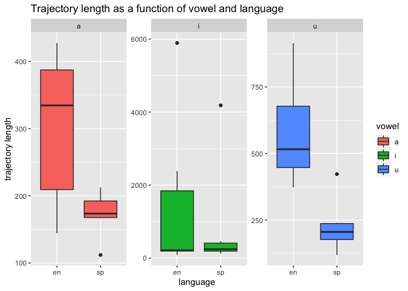

pa\_3
================

# Programming Assignment 3

## Answers to the questions

1.  Examine the portion of the script you see below. In your own words
    what does this section do and why does it work? Demonstrate that you
    understand the code….

**This part of the code calculates the time landmarks of the vowels. The
first two lines get the values of the onset and the offset of the
vowels. The third line calculates the duration of the vowels, which is
the difference between the offset and the onset. The next five lines
calculate the values of the 5 time landmarks by adding the vowel onset
value to the product of the vowel duration multiplied by the percentage
that corresponds to the time landmark.**

2.  In a few short sentences describe the general outline of the script,
    what the purpose is, and how it acheives this purpose (hint: focus
    on the section dividers and the comments)

**The code reads the .wav file and the textgrid, obtains information
about the vowels, and saves the results in a .csv file. The code is
divided in three parts:**

**The first part of the code sets the folder in which the generated .csv
file will be stored, chooses a name for the .csv file, deletes the
current output file, and creates the file and the headers for the
columns in the .csv file.**

**The second part sets up the loop. The code sets the path to the folder
where the stimuli files are stored, gets the .wav file, creates strings
for .wav file, reads the .wav file and the textgrid, checks the
intervals in the textgrid, sets default values, and adds a string
variable for a personal id.**

**The third part of the code runs the loop. It gets the labels of the
intervals, gets the onset and offset of the intervals, gets the item and
vowel labels, gets the language label, calculates the vowel onset and
offset as well as the duration of the vowels, calculates the time
landmarks, gets formants, calculates spectral centroids and trajectory
length, prints the results, saves the results to the .csv file, ends the
loop, and removes all the objects from the Praat menu.**

3.  In a few short sentences describe how the segmenting procedure you
    used this week differs from that used in pa\_2. What are the
    advantages and disadvantages?

**In pa\_2, we had to label the items in the master .wav file and
segment the master .wav file into several .wav files (one file per
item). Then, we had to manually create a textgrid for each segmented
.wav file and added vowel labels. In the end, we ended up with several
segmented .wav files and their corresponding textgrids. The loop
accessed each .wav file and the corresponding textrgrid to extract
information.**

**In pa\_3, we did not have to segment the master .wav file into several
.wav files. Instead, we added all the necessary labels to the master
.wav file and used the loop to extract all the necessary information
directly from the master .wav file.**

**The advantage of using the segmenting procedure of pa\_3 is that it
saves time and labor since we do not have to create many .wav files and
textgrids and manually manipulate them. Since there are more steps to
follow in the procedure of pa\_2, there may be more room for errors.
However, the disadvantage is that we have all the items in the same .wav
file, which might cause difficulties depending on how we intend to
analyze the stimuli. Both procedures could be useful depending on the
needs of our
    study.**

## Load libraries and read the data in the csv file

``` r
library(tidyverse)
```

    ## ── Attaching packages ─────────────────────────── tidyverse 1.3.0 ──

    ## ✓ ggplot2 3.3.0     ✓ purrr   0.3.3
    ## ✓ tibble  2.1.3     ✓ dplyr   0.8.5
    ## ✓ tidyr   1.0.0     ✓ stringr 1.4.0
    ## ✓ readr   1.3.1     ✓ forcats 0.4.0

    ## ── Conflicts ────────────────────────────── tidyverse_conflicts() ──
    ## x dplyr::filter() masks stats::filter()
    ## x dplyr::lag()    masks stats::lag()

``` r
read_csv("data/vowel_data.csv")
```

    ## Parsed with column specification:
    ## cols(
    ##   id = col_character(),
    ##   item = col_character(),
    ##   vowel = col_character(),
    ##   language = col_character(),
    ##   f1_cent = col_double(),
    ##   f2_cent = col_double(),
    ##   tl = col_double(),
    ##   f1_20 = col_double(),
    ##   f1_35 = col_double(),
    ##   f1_50 = col_double(),
    ##   f1_65 = col_double(),
    ##   f1_80 = col_double(),
    ##   f2_20 = col_double(),
    ##   f2_35 = col_double(),
    ##   f2_50 = col_double(),
    ##   f2_65 = col_double(),
    ##   f2_80 = col_double()
    ## )

    ## # A tibble: 36 x 17
    ##    id    item  vowel language f1_cent f2_cent     tl f1_20 f1_35 f1_50 f1_65
    ##    <chr> <chr> <chr> <chr>      <dbl>   <dbl>  <dbl> <dbl> <dbl> <dbl> <dbl>
    ##  1 jjgp  meet  i     en          359.   1655. 5893.   482.  400.  293.  335.
    ##  2 jjgp  beat  i     en          317.   2537.  220.   307.  294.  282.  310.
    ##  3 jjgp  feet  i     en          343.   2569.  207.   324.  351.  384.  328.
    ##  4 jjgp  seat  i     en          336.   2555.  190.   334.  359.  349.  295.
    ##  5 jjgp  heat  i     en          327.   2600.   86.7  311.  318.  354.  327.
    ##  6 jjgp  fleet i     en          333.   2308. 2385.   326.  306.  331.  345.
    ##  7 jjgp  moss  a     en          623.    945.  144.   604.  613.  626.  635.
    ##  8 jjgp  bot   a     en          622.   1027.  382.   618.  624.  628.  643.
    ##  9 jjgp  foug… a     en          620.   1032.  427.   610.  615.  615.  664.
    ## 10 jjgp  soug… a     en          619.   1054.  183.   615.  626.  660.  638.
    ## # … with 26 more rows, and 6 more variables: f1_80 <dbl>, f2_20 <dbl>,
    ## #   f2_35 <dbl>, f2_50 <dbl>, f2_65 <dbl>, f2_80 <dbl>

## Assign the data to an object df

``` r
df = read_csv("data/vowel_data.csv")
```

    ## Parsed with column specification:
    ## cols(
    ##   id = col_character(),
    ##   item = col_character(),
    ##   vowel = col_character(),
    ##   language = col_character(),
    ##   f1_cent = col_double(),
    ##   f2_cent = col_double(),
    ##   tl = col_double(),
    ##   f1_20 = col_double(),
    ##   f1_35 = col_double(),
    ##   f1_50 = col_double(),
    ##   f1_65 = col_double(),
    ##   f1_80 = col_double(),
    ##   f2_20 = col_double(),
    ##   f2_35 = col_double(),
    ##   f2_50 = col_double(),
    ##   f2_65 = col_double(),
    ##   f2_80 = col_double()
    ## )

## Descriptive Statistics

### 1\. Calculate average F1 centroid and standard deviation

``` r
mean(df$f1_cent)
```

    ## [1] 455.0925

``` r
sd(df$f1_cent)
```

    ## [1] 164.8963

### 2\. Calculate average F2 centroid and standard deviation

``` r
mean(df$f2_cent)
```

    ## [1] 1515.593

``` r
sd(df$f2_cent)
```

    ## [1] 681.7228

### 3\. Calculate average trajectory length and standard deviation

``` r
mean(df$tl)
```

    ## [1] 614.2286

``` r
sd(df$tl)
```

    ## [1] 1174.152

## Plots

### 1\. Trajectory length as a function of vowel and language

``` r
ggplot(df, aes(x=language, y=tl, fill=vowel)) + 
    geom_boxplot()+
  facet_wrap(~vowel)+
  labs(title = "Trajectory length as a function of vowel and language", y = "trajectory length")
```

<!-- -->

``` r
ggplot(df, aes(x=language, y=tl, fill=vowel)) + 
    geom_boxplot() +
    facet_wrap(~vowel, scale="free")+
  labs(title = "Trajectory length as a function of vowel and language", y = "trajectory length")
```

<!-- -->

### 2\. F1 as a function of vowel and language

``` r
ggplot(df, aes(x=language, y=f1_cent, fill=vowel)) + 
    geom_boxplot()+
  facet_wrap(~vowel)+
  labs(title = "F1 centroid as a function of vowel and language")
```

<!-- -->

``` r
ggplot(df, aes(x=language, y=f1_cent, fill=vowel)) + 
    geom_boxplot() +
    facet_wrap(~vowel, scale="free")+
  labs(title = "F1 centroid as a function of vowel and language")
```

<!-- -->

### 3\. F2 as a function of vowel and language

``` r
ggplot(df, aes(x=language, y=f2_cent, fill=vowel)) + 
    geom_boxplot()+
  facet_wrap(~vowel)+
  labs(title = "F2 centroid as a function of vowel and language")
```

<!-- -->

``` r
ggplot(df, aes(x=language, y=f2_cent, fill=vowel)) + 
    geom_boxplot() +
    facet_wrap(~vowel, scale="free") +
  labs(title = "F2 centroid as a function of vowel and language")
```

<!-- -->

## FREEBIE

``` r
# Plot both vowel spaces together ---------------------------------------------

#
# This assumes your dataframe is called 'vowels'
# Before it will work you need to change 'eval=F' to 'eval=T'
#

vowel_means <- df %>% 
  group_by(vowel, language) %>% 
  summarize(f1_cent = mean(f1_cent), f2_cent = mean(f2_cent)) %>% 
  ungroup() %>% 
  mutate(order = case_when(vowel == "i" ~ 1, vowel == "a" ~ 2, TRUE ~ 3), 
         vowel = forcats::fct_reorder2(vowel, vowel, order)) %>% 
  arrange(order)

df %>% 
  mutate(vowel = forcats::fct_relevel(vowel, "u", "a", "i")) %>% 
  ggplot(., aes(x = f2_cent, y = f1_cent, color = language, label = vowel)) + 
    geom_text(size = 3.5, alpha = 0.6, show.legend = F) + 
    geom_path(data = vowel_means, aes(group = language, lty = language), 
              color = "grey") + 
    geom_text(data = vowel_means, show.legend = F, size = 7) + 
    scale_y_reverse() + 
    scale_x_reverse() + 
    scale_color_brewer(palette = "Set1") + 
    labs(title = "Vowel space comparison", 
         subtitle = "Spectral centroids of English/Spanish cardinal vowels", 
         y = "F1 (hz)", x = "F2 (hz)") + 
    theme_minimal(base_size = 16)
```


``` r
# -----------------------------------------------------------------------------
```
